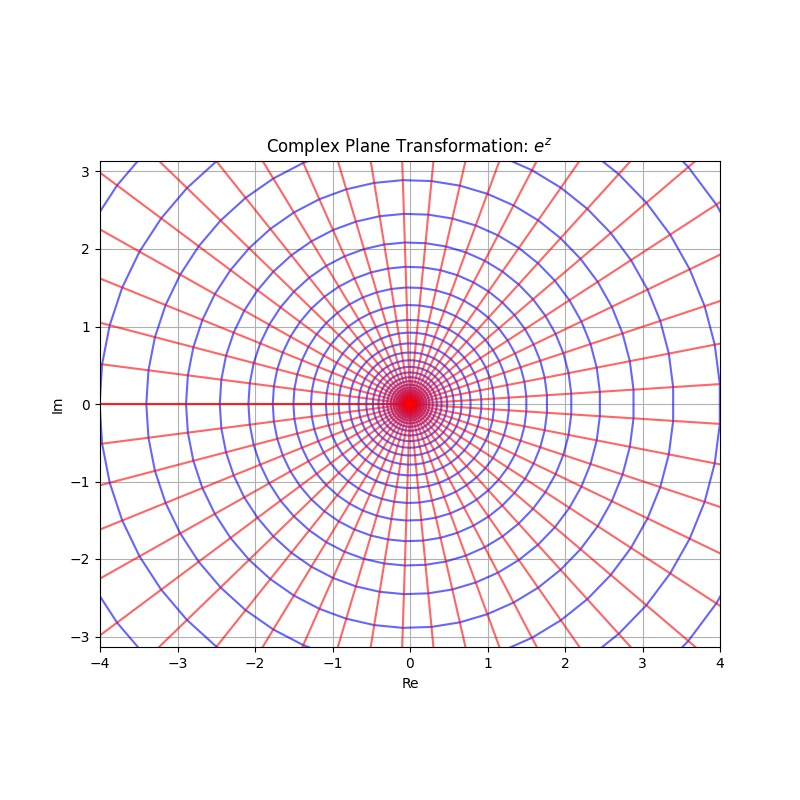

# Z Transform and Its Properties

## From DTFT to Z Transform

From DTFT, we have,

$$
x[t] = \frac{1}{2\pi} \int_{-\pi}^{+\pi} X(\omega) e^{j \omega t} \mathrm{d} \omega \\
X(\omega) = \sum_{-\infty}^{+\infty} x[t] e^{-j \omega t}
$$

Again, we multiply the kernel with a real exponential, just like Laplace Transform (z transform is a discrete version of Laplace Transform). We note, $z = e^{j \omega + \sigma}$, thus,

$$
X(z) = \sum_{t = -\infty}^{+\infty} x[t] z^{-t}
$$

If we would like $X(z)$ to converge on the positive side, we need,

$$
\lim_{t \to +\infty} |\frac{x[t + 1] z^{-(t + 1)}}{x[t] z^{-t}}| < 1
$$

Which is equivalent to,

$$
|z| > \lim_{t \to +\infty} \frac{x[t]}{x[t + 1]}
$$

And vice versa on the negative side.

$$
|z| < \lim_{t \to -\infty} \frac{x[t]}{x[t - 1]}
$$

:::tip

For certain points that,

$$
|z| = \lim_{t \to +\infty} \frac{x[t]}{x[t + 1]}
$$

Wether the series will converge depends on the phase of $z$. However, on this circle, it is guaranteed to have at least one point where the series will not converge.

And vice versa for the negative side.

:::

And technically,

$$
x[t] = -j \frac{1}{2\pi} \int_{-j \pi + \sigma}^{+j\pi + \sigma} X(z) z^t \mathrm{d} (j \omega + \sigma) \\
= \frac{1}{2\pi j} \int_{e^{-j \pi + \sigma}}^{e^{+j\pi + \sigma}} X(z) z^{t - 1} \mathrm{d}z
$$

But, wait, $e^{-j \pi + \sigma} = e^{+j\pi + \sigma}$, what does the integral do?

Let's consider $e^{jx + \sigma}$ where $x$ walks from $-\pi$ to $\pi$. This means that, the function walks through a circle with radius $e^\sigma$.

In the picture, that is starting from a point, walking alongside the blue line (the old line that was parallel to the real line before the transformation). A round is $2\pi$ of $x$.

That is to say,

$$
x[t] = \frac{1}{2\pi j} \oint_{C(e^\sigma)} X(z) z^{t - 1} \mathrm{d}z
$$

And $C(e^\sigma)$ is a circle with radius $e^\sigma$. The value of $\sigma$ is dependent on the region of convergence.

For convenience, if we write $C$, it means a circle of radius one.

:::info

There is another way to directly get the inverse z transform, because,

$$
X(z) = \sum_{t = -\infty}^{+\infty} x[t] z^{-t}
$$

Based on the Cauchy Integral, that,

$$
\oint_{P} \frac{f(z)}{(z-z_0)^n} \mathrm{d}z = 2\pi j \frac{f^{(n - 1)}(z_0)}{n!} \\
\text{Where} \quad f(z) \text{ is continuous within } P \text{ and } P \text{ is any curve that contains } z_0
$$

So if we want $x[t]$, then consider,

$$
X(z) z^{t - 1} = \sum_{k = -\infty}^{+\infty} x[k] z^{-k + t - 1}
$$

Thus,

$$
\oint_{C(r)} X(z) z^{t-1} \mathrm{d}z = 2 \pi j x[t]
$$

$X(z)$ exists so $C$ must have a valid range of $r$.

:::

Similarly, we sometimes also use single side z transform. We don't usually care about the negative side.

So in conclusion,

The z transform is,

$$
x[t] = \frac{1}{2\pi j} \oint_{C(e^\sigma)} X(z) z^{t - 1} \mathrm{d}z \\
X(z) = \sum_{t = -\infty}^{+\infty} x[t] z^{-t} \quad e^{\sigma_0} < |z| < e^{\beta_0}
$$

The single side z transform is,

$$
x[t] = \frac{1}{2\pi j} \oint_{C(e^\sigma)} X(z) z^{t - 1} \mathrm{d}z \\
X(z) = \sum_{t = 0}^{+\infty} x[t] z^{-t} \quad |z| > e^{\sigma_0}
$$

We note the pair as,

$$
x(t) \xrightarrow{\pm \mathcal{Z}} X(z) \quad |z| > e^{\sigma_0}
$$

And the single side pair as,

$$
x(t) \xrightarrow{\mathcal{Z}} X(z) \quad e^{\sigma_0} < |z| < e^{\beta_0}
$$

## Properties

### Linearity

$$
a x[t] + b y[t] \xrightarrow{\mathcal{Z}} a X(z) + b Y(z) \quad |z| > \max(e^{\sigma_0}, e^{\sigma_1})
$$

$$
a x[t] + b y[t] \xrightarrow{\pm \mathcal{Z}} a X(z) + b Y(z) \quad \max(e^{\sigma_0}, e^{\sigma_1}) < |z| < \min(e^{\beta_0}, e^{\beta_1})
$$

### Shifting Time is Shifting Phase

We need to distinguish three cases when we consider time shifting.

- Two sides z transform
- Single side z transform on casual signals
- Single side z transform on non-casual signals

Previously in the Laplace Transform, we only talked about single side transform on casual signals, because time shifting isn't very important in practice of Laplace Transform. However, since difference equation utilizes shifting, it's crucial to consider all off the three cases.

Again, in the following sections, if we don't say otherwise, the region of convergence won't change.

#### Shifting Time in Two Sides Z Transform

Suppose,

$$
x[t] \xrightarrow{\pm \mathcal{Z}} X(z)
$$

We have,

$$
\sum_{t = -\infty}^{+\infty} x[t + t_0] z^{-t} \\
= z^{t_0} \sum_{t + t_0 = -\infty}^{+\infty} x[t] z^{- (t + t_0)} \\
= z^{t_0} X(z)
$$

That's to say,

$$
x[t + t_0] \xrightarrow{\pm \mathcal{Z}} z^{t_0} X(z)
$$

#### Shifting Time in Single Side Z Transform for Casual Signals

Casual signals are signals that has value zero on the negative side. Thus,

$$
x[t]u[t] \xrightarrow{\mathcal{Z}} X(z)
$$

$$
\sum_{t = 0}^{+\infty} x[t + t_0] u[t + t_0] z^{-t} \\
= z^{t_0} \sum_{t + t_0 = t_0}^{+\infty} x[t + t_0] u[t + t_0] z^{-(t + t_0)} \\
= z^{t_0} \sum+{t + t_0 = 0}^{+\infty} x[t + t_0] u[t + t_0] z^{-(t + t_0)} \\
= z^{t_0} X(z)
$$

That's to say,

$$
x[t + t_0] u[t + t_0] \xrightarrow{\mathcal{Z}} z^{t_0} X(z)
$$

#### Shifting Time in Single Side Z Transform for Non-Casual Signals

Again,

$$
x[t] \xrightarrow{\mathcal{Z}} X(z)
$$

We need to distinct the shift towards the postive side and the shift towards the negative side. Thus, we assume $t_0 \geq 0$.

For moving towards the negative side, the result is,

$$
\sum_{t = 0}^{+\infty} x[t + t_0] z^{-t} \\ 
= z^{t_0} \sum_{t + t_0 = t_0}^{+\infty} x[t + t_0] z^{-(t + t_0)} \\
= z^{t_0} (\sum_{t + t_0 = 0}^{+\infty} x[t + t_0] z^{-(t + t)} - \sum_{t + t_0 = 0}^{t_0 - 1} x[t + t_0] z^{-(t + t_0)}) \\
= z^{t_0} X(z) - z^{t_0} \sum_{t + t_0 = 0}^{t_0 - 1} x[t + t_0] z^{-(t + t_0)}
$$

Kind of ugly, to be honest.

For moving towards the positive side, the result is,

$$
\sum_{t = 0}^{+\infty} x[t - t_0] z^{-t} \\
= z^{-t_0} \sum_{t - t_0 = -t_0}^{+\infty} x[t - t_0] z^{-(t - t_0)} \\
= z^{-t_0} (\sum_{t - t_0 = 0}^{+\infty} x[t - t_0] z^{-(t - t_0)} + \sum_{t - t_0 = -t_0}^{-1} x[t - t_0] z^{-(t - t_0)}) \\
= z^{-t_0} X(z) + z^{-t_0} \sum_{t - t_0 = -t_0}^{-1} x[t - t_0] z^{-(t - t_0)}
$$

Well, just as ugly.

In conclusion, for $t_0 \geq 0$,

$$
x[t - t_0] \xrightarrow{\mathcal{Z}} z^{-t_0} X(z) + z^{-t_0} \sum_{t - t_0 = -t_0}^{-1} x[t - t_0] z^{-(t - t_0)}
$$

$$
x[t + t_0] \xrightarrow{\mathcal{Z}} z^{t_0} X(z) - z^{t_0} \sum_{t + t_0 = 0}^{t_0 - 1} x[t + t_0] z^{-(t + t_0)}
$$

It's better that we simply memorize the case for pushing back $1$ and $2$, because they'll be used later,

$$
x[t - 1] \xrightarrow{\mathcal{Z}} z^{-1} X(z) + x[-1] \\
x[t - 2] \xrightarrow{\mathcal{Z}} z^{-2} X(z) + x[-1] z^{-1} + x[-2]
$$

For forwarding operators,

$$
x[t + 1] \xrightarrow{\mathcal{Z}} z^{1} X(z) - x[0] \\
x[t + 2] \xrightarrow{\mathcal{Z}} z^{2} X(z) - x[0] z^{1} - x[1] z^{2}
$$

### Z-Scale

$$
x[t] \xrightarrow{\mathcal{Z}} X(z) \quad |z| < e^{\sigma_0}
$$

$$
\sum_{t = -\infty}^{+\infty} x[t] a^{-t} z^{-t} \\
= \sum_{t = 0}^{+\infty} x[t] (az)^{-t} \\
= X(az)
$$

$$
a^{-t}x[t] \xrightarrow{\mathcal{Z}} X(az) \quad |az| < e^{\sigma_0}
$$

Similarly,

$$
a^{-t}x[t] \xrightarrow{\pm \mathcal{Z}} X(az) \quad e^{\sigma_0} < |az| < e^{\beta_0}
$$

### Z-Derivative

$$
x[t] \xrightarrow{\mathcal{Z}} X(z)
$$

That is,

$$
X(z) = \sum_{t = 0}^{+\infty} x[t] z^{-t}
$$

Take derivative,

$$
\frac{\mathrm{d} X(z)}{\mathrm{d} z} = -\sum_{t = 0}^{+\infty} t x[t] z^{-t - 1}
$$

$$
-z \frac{\mathrm{d} X(z)}{\mathrm{d} z} = \sum_{t = 0}^{+\infty} t x[t] z^{-t}
$$

And thus,

$$
t x[t] \xrightarrow{\mathcal{Z}} -z \frac{\mathrm{d} X(z)}{\mathrm{d} z}
$$

It's identical to the two sides,

$$
t x[t] \xrightarrow{\pm \mathcal{Z}} -z \frac{\mathrm{d} X(z)}{\mathrm{d} z}
$$

### Initial and Final Value Theorems

Suppose the sequence is right side- that is, there is an $M$ such that,

$$
x[t] = 0 \quad t < M
$$

And,

$$
X(z) = \sum_{t = M}^{+\infty} x[t] z^{-t}
$$

Thus,

$$
\lim_{z \to +\infty} X(z) z^{M} \\
= \lim_{z \to +\infty} \sum_{t = M}^{+\infty} x[t] z^{-(t - M)} \\ 
= x[M]
$$

That is,

$$
x[M] = \lim_{z \to +\infty} X(z) z^{M}
$$

For causal signals,

$$
x[0] = \lim_{z \to +\infty} X(z)
$$

As for the final value theorem, consider,

$$
X(z) = \sum_{t = M}^{+\infty} x[t] z^{-t}
$$

And,

$$
\lim_{z \to 1} (z - 1) X(z) \\
= \lim_{z \to 1} \sum_{t = M}^{+\infty} x[t] (z^{-t} - z^{-(t + 1)}) \\
= \lim_{z \to 1} \sum_{t = M}^{+\infty} (x[t+1] - x[t]) z^{-t} - x[M] z^{-M} \\
= x[+\infty]
$$

That is to say,

$$
x[+\infty] = \lim_{z \to 1} (z - 1) X(z)
$$

This requires convergence condition of,

$$
e^{\sigma} < |z|
$$

Where,

$$
e^{\sigma} < 1
$$

This is because we are approaching $z$ to one, and thus one must be in the circle.

In conclusion,

The initial value theorem is,

$$
x[M] = \lim_{z \to +\infty} X(z) z^{M}
$$

The final value theorem is,

$$
x[+\infty] = \lim_{z \to 1} (z - 1) X(z)
$$

### Convolution

Consider,

$$
x[t] \xrightarrow{\mathcal{Z}} X(z) \quad e^{\sigma_0} < |z| \\
y[t] \xrightarrow{\mathcal{Z}} Y(z) \quad e^{\sigma_1} < |z|
$$

Then, we define a single-side convolution,

$$
x[t] \ast y[t] = \sum_{m = 0}^{+\infty} x[t - m] y[m]
$$

Perform z transform on the both sides,

$$
\mathcal{Z}(x[t] \ast y[t]) = \sum_{t = 0}^{+\infty} \sum_{m = -\infty}^{+\infty} x[t - m] y[m] z^{-t} \\
= \sum_{t = 0}^{+\infty} \sum_{m = 0}^{+\infty} x[t - m] z^{-(t - m)} y[m] z^{-m} \\
= X(z) Y(z)
$$

And thus,

$$
x[t] \ast y[t] \xrightarrow{\mathcal{Z}} X(z) Y(z) \quad \max{e^{\sigma_0}, e^{\sigma_1}} < |z|
$$

For two side transform,

$$
x[t] \ast y[t] \xrightarrow{\pm \mathcal{Z}} X(z) Y(z) \quad \max{e^{\sigma_0}, e^{\sigma_1}} < |z| <  \min{e^{\beta_0}, e^{\beta_1}}
$$

In both cases, the region of convergence is the intersect of the two old regions of convergence.
